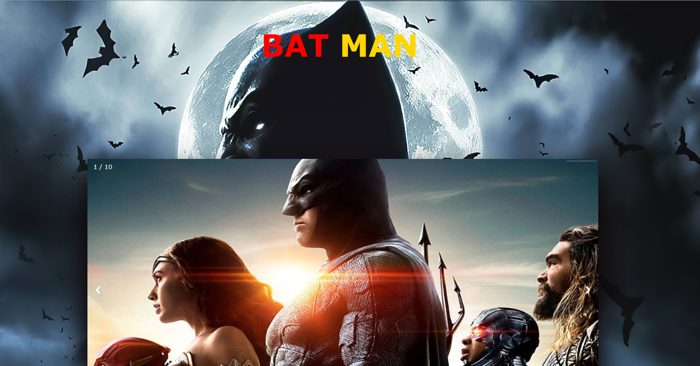
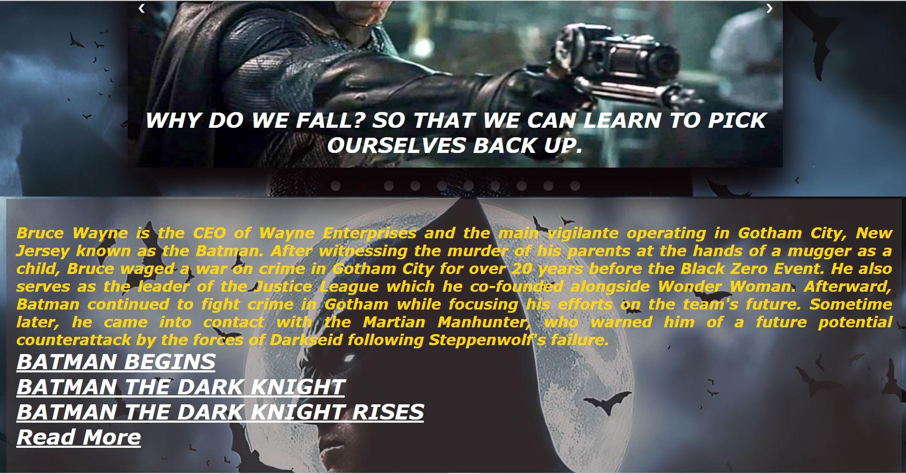

***This new Web Page is created by Ankita Sikder, students of BTECH, in University of Engineering and Management, Kolkata.***

***Email Id: ankita.sikder14@gmail.com.***

***Contact No: 8583939774.***

# BATMAN-WEBPAGE :star_struck: :open_mouth: :sunglasses: :facepunch:

  

## About :point_down:

  
This is a web page of DC Comic's super hero Batman. He is one of the most famous superheroes in marvel, dc and other comics. Batman or Bruce Wayne, Ceo of Wayne Industries, savior of Gotham has worldwide fans of his wealth, thaughts of justice etc. This webpage is for dc and Batman fans. Everyone likes superheroes and their stories, origines, powers, thaughts. So, I have assembled many interesting facts, supercool images and also movie links of Batman Trilogy here. The fans and newcomers of dc world can easily know everything about the great super hero Batman. Here I have added slider of 10 images for getting a very nice view on this character.

***LINK : :point_right: ***
  
## Why I have made this :point_down:

I have made this webpage for the fans of Batman and also those who want to know about this world famous sperhero. Users can explore many facts, images, movie links using this web page.

## Some Resources of this project :point_down:

     
I have used basic concepts of web development to make this web application. I have used HTML5, CSS3 and JAVASCRIPT only. I have used slider, some good images and text formatting concepts for designing.  
I have used _[dc fandom wiki]_(https://dc.fandom.com/wiki/DC_Comics_Database) for references of the character. I have used _[primevideo]_(https://www.primevideo.com/) for movie links.

     
## Some Screenshots of this project :point_down:

     
 

